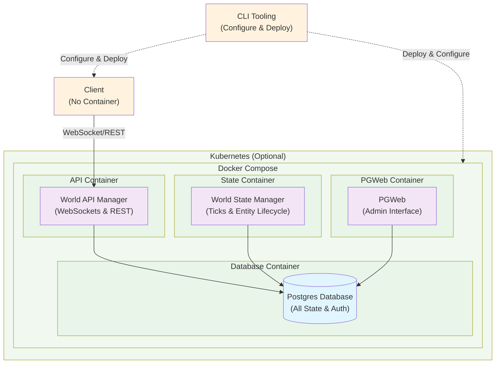

# Introduction

## Get started

:::note
This is a work in progress and is not yet ready for production use until the version becomes 1.0.0 or higher unless you have direct support from the Vircadia team.
:::

### Clone the repository

Be sure to clone recursively:

```sh
git clone https://github.com/vircadia/vircadia-world.git --recursive
```
or if you've already cloned the repo:
```sh
git submodule update --init --recursive
```

Pull any assets with Git LFS:

```sh
git lfs install
git lfs pull
```

### Deploy

Afterward, use the [CLI](./cli/README.mdx) to install and deploy the project.

## Architecture



See the main [website](https://vircadia.com) for an alternate overview of the features available.

## Next

The `next` branch is where new updates are merged before being pushed to `master`.
