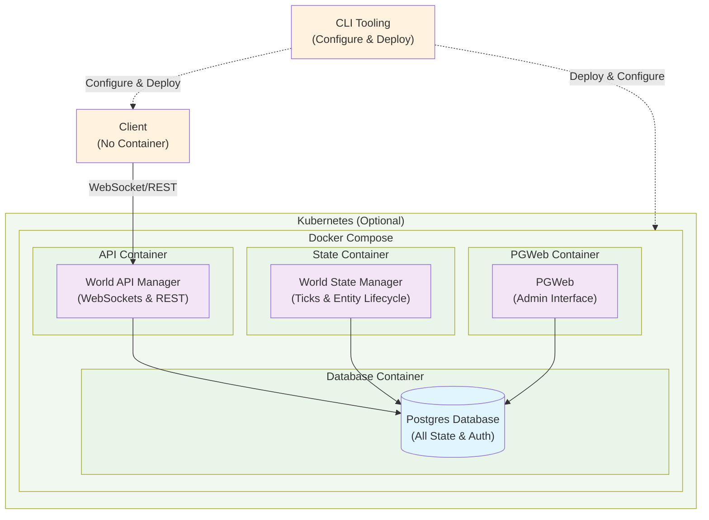

# Introduction

## Get started

:::note
This is a work in progress and is not yet ready for production use until the version becomes 1.0.0 or higher unless you have direct support from the Vircadia team.
:::

### Clone the repository

Be sure to clone recursively:

```sh
git clone https://github.com/vircadia/vircadia-world.git --recursive
```
or if you've already cloned the repo:
```sh
git submodule update --init --recursive
```

Pull any assets with Git LFS:

```sh
git lfs install
git lfs pull
```

### Deploy

Afterward, use the [CLI](./cli/README.mdx) to install and deploy the project.

## Architecture


```mermaid
graph TB
    subgraph K8s["Kubernetes (Optional)"]
        subgraph DockerCompose["Docker Compose"]
            subgraph APIContainer["API Container"]
                API["World API Manager<br/>(WebSockets & REST)"]
            end
            
            subgraph StateContainer["State Container"]
                State["World State Manager<br/>(Ticks & Entity Lifecycle)"]
            end
            
            subgraph PGWebContainer["PGWeb Container"]
                PGWeb["PGWeb<br/>(Admin Interface)"]
            end
            
            subgraph DBContainer["Database Container"]
                Postgres[("Postgres Database<br/>(All State & Auth)")]
            end
            
            API --> Postgres
            State --> Postgres
            PGWeb --> Postgres
        end
    end
    
    CLI["CLI Tooling<br/>(Configure & Deploy)"]
    Client["Client<br/>(No Container)"]
    
    CLI -.->|Deploy & Configure| DockerCompose
    CLI -.->|Configure & Deploy| Client
    Client -->|WebSocket/REST| API
    
    classDef database fill:#e1f5fe
    classDef service fill:#f3e5f5
    classDef external fill:#fff3e0
    classDef container fill:#e8f5e8
    classDef containerGroup fill:#f0f8f0
    
    class Postgres database
    class API,State,PGWeb service
    class CLI,Client external
    class APIContainer,StateContainer,PGWebContainer,DBContainer container
    class DockerCompose,K8s containerGroup
```

See the main [website](https://vircadia.com) for an alternate overview of the features available.

## External integrations

The architecture above also provides a useful boundary for external clients and services: they should integrate through the public interfaces exposed by a Vircadia World deployment rather than depending directly on internal containers or database state.

When building an external integration:

- treat authentication and world state as belonging to the Vircadia World deployment you are connecting to;
- prefer the documented WebSocket/REST interface between the client and World API Manager over direct database access;
- pin or record the Vircadia World version/commit used by the integration so behavior can be reproduced;
- keep third-party identity, authorization, and asset licensing decisions explicit instead of assuming they are shared with Vircadia World;
- avoid presenting compatibility with an external project as an official partnership or endorsement unless that relationship is separately established.

These boundaries make integrations easier to audit and reduce coupling to implementation details that may change while the project is still pre-1.0.

## Next

The `next` branch is where new updates are merged before being pushed to `master`.
