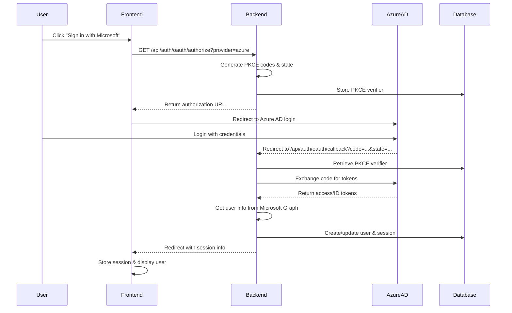

# Implementing Azure AD Authentication in Vue 3 with MSAL, Pinia, and VueUse

This guide outlines how to build a robust Azure AD authentication flow in a Vue 3 SPA. We will use `@azure/msal-browser` for handling the authentication flow, Pinia for centralized state management, and `@vueuse/core` for persisting the authentication state in the browser's local storage.

## Prerequisites

First, ensure you have the necessary libraries installed:

```bash
npm install @azure/msal-browser pinia @vueuse/core
```

## Step 1: Configure MSAL

Your existing `src/authConfig.ts` is the central place for MSAL configuration. No changes are needed there, but it's the foundation of the setup.

```typescript
// src/authConfig.ts
import { Configuration } from "@azure/msal-browser";

export const msalConfig: Configuration = {
  auth: {
    clientId: "YOUR_CLIENT_ID", // Your app's client ID from Azure portal
    authority: "https://login.microsoftonline.com/YOUR_TENANT_ID", // Your app's tenant ID
    redirectUri: "http://localhost:3000", // Must match the redirect URI in your app registration
  },
  cache: {
    cacheLocation: "localStorage", // This configures where your cache will be stored
    storeAuthStateInCookie: false, // Set to true if you have issues on IE11 or Edge
  },
};
```

## Step 2: Create a Pinia Store for Authentication

Create a new file `src/store/auth.ts` to manage authentication state. This store will encapsulate all MSAL logic, making it easy to access from any component. We'll use `@vueuse/storage` to make the user's account information persist across browser sessions.

```typescript
// src/store/auth.ts
import { defineStore } from "pinia";
import { useStorage } from "@vueuse/core";
import { PublicClientApplication, type AuthenticationResult, type AccountInfo } from "@azure/msal-browser";
import { msalConfig } from "../authConfig";

export const useAuthStore = defineStore("auth", () => {
  const msalInstance = new PublicClientApplication(msalConfig);
  const account = useStorage<AccountInfo | null>("msal-account", null, localStorage);

  const login = async () => {
    try {
      await msalInstance.loginRedirect();
    } catch (err) {
      console.error("Login failed:", err);
    }
  };

  const logout = async () => {
    if (account.value) {
      try {
        await msalInstance.logoutRedirect({ account: account.value });
        account.value = null;
      } catch (err) {
        console.error("Logout failed:", err);
      }
    }
  };

  const handleRedirect = async () => {
    try {
      const response: AuthenticationResult | null = await msalInstance.handleRedirectPromise();
      if (response && response.account) {
        account.value = response.account;
      }
    } catch (err) {
      console.error("Redirect handling failed:", err);
      account.value = null;
    }
  };
  
  const acquireToken = async (scopes: string[]) => {
    if (!account.value) {
        throw new Error("User not authenticated. Cannot acquire token.");
    }
    try {
        const response = await msalInstance.acquireTokenSilent({
            scopes,
            account: account.value,
        });
        return response.accessToken;
    } catch (error) {
        // Fallback to interactive method if silent fails
        console.warn("Silent token acquisition failed. Falling back to redirect.", error);
        return msalInstance.acquireTokenRedirect({ scopes });
    }
  };


  return {
    account,
    login,
    logout,
    handleRedirect,
    acquireToken,
    isAuthenticated: () => !!account.value,
  };
});
```

## Step 3: Integrate Pinia and Handle Redirect in App.vue

In your main entry point (`src/main.ts`), make sure you install Pinia.

```typescript
// src/main.ts
import { createApp } from "vue";
import { createPinia } from "pinia";
import App from "./App.vue";
import router from "./router/router";

const app = createApp(App);
const pinia = createPinia();

app.use(pinia);
app.use(router);
app.mount("#app");
```

Next, in your root `App.vue` component, call the `handleRedirect` action when the component mounts. This will process the authentication response from Azure AD after the user is redirected back to your application.

```vue
<!-- src/App.vue -->
<script setup lang="ts">
import { onMounted } from "vue";
import { useAuthStore } from "./store/auth";
import NavBar from "./components/NavBar.vue";

const authStore = useAuthStore();

onMounted(() => {
  authStore.handleRedirect();
});
</script>

<template>
  <div id="app">
    <NavBar />
    <main>
      <router-view />
    </main>
  </div>
</template>
```

## Step 4: Create UI Components for Sign-In and Sign-Out

Your existing components can be simplified to use the new Pinia store.

**SignInButton.vue**
This component will trigger the `login` action from the auth store.

```vue
<!-- src/components/SignInButton.vue -->
<script setup lang="ts">
import { useAuthStore } from "../store/auth";

const authStore = useAuthStore();

const handleLogin = () => {
  authStore.login();
};
</script>

<template>
  <button @click="handleLogin">Sign In</button>
</template>
```

**SignOutButton.vue**
This component will trigger the `logout` action.

```vue
<!-- src/components/SignOutButton.vue -->
<script setup lang="ts">
import { useAuthStore } from "../store/auth";

const authStore = useAuthStore();

const handleLogout = () => {
  authStore.logout();
};
</script>

<template>
  <button @click="handleLogout">Sign Out</button>
</template>
```

**WelcomeName.vue**
Display the user's name from the store.

```vue
<!-- src/components/WelcomeName.vue -->
<script setup lang="ts">
import { useAuthStore } from "../store/auth";
import { computed } from "vue";

const authStore = useAuthStore();
const username = computed(() => authStore.account?.username || "User");
</script>

<template>
  <span v-if="authStore.isAuthenticated()">Welcome, {{ username }}</span>
</template>
```

## Step 5: Protect Routes with a Navigation Guard

You can protect routes by creating a navigation guard that checks the authentication status from the Pinia store.

```typescript
// src/router/Guard.ts
import { type Router } from "vue-router";
import { useAuthStore } from "../store/auth";

export function registerGuard(router: Router) {
  router.beforeEach((to, from, next) => {
    const authStore = useAuthStore();
    const requiresAuth = to.matched.some(record => record.meta.requiresAuth);

    if (requiresAuth && !authStore.isAuthenticated()) {
      // You can either redirect to a login page or trigger the login flow directly
      authStore.login();
    } else {
      next();
    }
  });
}
```

Then, register the guard in your router setup and define which routes require authentication.

```typescript
// src/router/router.ts
import { createRouter, createWebHistory } from "vue-router";
import Home from "../views/Home.vue";
import Profile from "../views/Profile.vue";
import { registerGuard } from "./Guard";

const routes = [
  {
    path: "/",
    name: "Home",
    component: Home,
  },
  {
    path: "/profile",
    name: "Profile",
    component: Profile,
    meta: {
      requiresAuth: true, // This route requires authentication
    },
  },
  // ... other routes
];

const router = createRouter({
  history: createWebHistory(),
  routes,
});

// Register the guard
registerGuard(router);

export default router;
```

This completes the implementation of a robust and maintainable Azure AD authentication flow in your Vue 3 application using MSAL, Pinia, and VueUse.

# Azure AD Integration Guide

This guide explains how the Azure AD authentication works in Vircadia and how to integrate it into your application.

## Architecture Overview

Vircadia uses a **server-side OAuth flow** for Azure AD authentication, which provides better security by keeping the client secret on the server side.



## Frontend Integration

### 1. Authentication Store

The authentication state is managed by Pinia store at `stores/authStore.ts`:

```typescript
const authStore = useAuthStore();

// Check if user is authenticated
if (authStore.isAuthenticated) {
    // User is logged in
    const token = authStore.getSessionToken();
    const sessionId = authStore.sessionId;
    const agentId = authStore.agentId;
}
```

### 2. Login Component

Use the `AzureADLoginButton` component to display the login/logout UI:

```vue
<template>
    <AzureADLoginButton />
</template>

<script setup lang="ts">
import AzureADLoginButton from "@/components/AzureADLoginButton.vue";
</script>
```

### 3. Making Authenticated API Calls

When making API calls, include the session token:

```typescript
const authStore = useAuthStore();
const token = authStore.getSessionToken();

// For REST API calls
const response = await fetch('/api/some-endpoint', {
    headers: {
        'Authorization': `Bearer ${token}`
    }
});

// For WebSocket connections
const ws = new WebSocket(`ws://api-server/ws?token=${token}&provider=azure`);
```

## Server Integration

### 1. Session Validation

Validate sessions in your API endpoints:

```typescript
// REST endpoint example
app.post('/api/some-endpoint', async (req, res) => {
    const token = req.headers.authorization?.replace('Bearer ', '');
    
    const validation = await validateJWT({
        provider: 'azure',
        token: token
    });
    
    if (!validation.isValid) {
        return res.status(401).json({ error: validation.errorReason });
    }
    
    // Use validation.agentId and validation.sessionId
});
```

### 2. WebSocket Authentication

For WebSocket connections, validate during the upgrade:

```typescript
// WebSocket upgrade example
if (url.pathname === '/ws') {
    const token = url.searchParams.get('token');
    const provider = url.searchParams.get('provider');
    
    const validation = await validateJWT({ provider, token });
    
    if (!validation.isValid) {
        return new Response('Unauthorized', { status: 401 });
    }
    
    // Upgrade connection with user context
    server.upgrade(req, {
        data: {
            agentId: validation.agentId,
            sessionId: validation.sessionId
        }
    });
}
```

## User Data Access

### Frontend

Access user information from the auth store:

```typescript
const authStore = useAuthStore();

// Basic user info
const username = authStore.account?.username || authStore.account?.name;
const email = authStore.account?.idTokenClaims?.email;

// Session info
const sessionId = authStore.sessionId;
const agentId = authStore.agentId;
```

### Backend

Query user data from the database:

```sql
-- Get user profile
SELECT * FROM auth.agent_profiles 
WHERE general__agent_profile_id = 'agent-id-here';

-- Get linked providers
SELECT * FROM auth.agent_auth_providers 
WHERE auth__agent_id = 'agent-id-here';

-- Validate session
SELECT * FROM auth.validate_session_id('session-id-here'::UUID) as agent_id;
```

## Multi-Provider Support

Users can link multiple authentication providers:

```typescript
// Link a new provider
const response = await fetch('/api/auth/link-provider', {
    method: 'POST',
    headers: { 'Content-Type': 'application/json' },
    body: JSON.stringify({
        provider: 'azure',
        sessionId: authStore.sessionId
    })
});

// List linked providers
const providers = await fetch(`/api/auth/list-providers?sessionId=${authStore.sessionId}`);

// Unlink a provider
const response = await fetch('/api/auth/unlink-provider', {
    method: 'POST',
    headers: { 'Content-Type': 'application/json' },
    body: JSON.stringify({
        provider: 'azure',
        providerUid: 'provider-uid-here',
        sessionId: authStore.sessionId
    })
});
```

## Security Best Practices

1. **Token Storage**: Tokens are stored in localStorage via VueUse's `useStorage`
2. **HTTPS Only**: Always use HTTPS in production
3. **Token Validation**: Always validate tokens on the server side
4. **Session Expiry**: Sessions expire after 24 hours by default
5. **CORS**: Configure CORS properly for your frontend domain

## Error Handling

Handle authentication errors gracefully:

```typescript
// In components
const authStore = useAuthStore();

watch(() => authStore.authError, (error) => {
    if (error) {
        // Display error to user
        console.error('Authentication error:', error);
    }
});

// Check authentication state
if (!authStore.isAuthenticated) {
    // Redirect to login or show login prompt
}
```

## Development Setup

For local development:

1. Ensure the API server is running on `http://localhost:3020`
2. Frontend dev server runs on `http://localhost:3066`
3. Configure Azure AD redirect URI to `http://localhost:3020/api/auth/oauth/callback`
4. Update database with Azure AD credentials (see AZURE_AD_SETUP.md)

## Production Deployment

1. Update redirect URI in Azure AD to production URL
2. Ensure HTTPS is configured
3. Update database configuration with production URLs
4. Set appropriate CORS headers
5. Configure session storage (Redis recommended for multi-server deployments)

## Troubleshooting

### Common Issues

1. **"No token provided" error**
   - Ensure user is logged in: `authStore.isAuthenticated`
   - Check token exists: `authStore.getSessionToken()`

2. **CORS errors**
   - Verify API server allows frontend origin
   - Check WebSocket upgrade headers

3. **Session expired**
   - Auth store will clear session automatically
   - Prompt user to login again

4. **OAuth callback errors**
   - Check browser console for specific error messages
   - Verify redirect URI matches exactly
   - Ensure database has correct Azure AD configuration

### Debug Mode

Enable debug logging:

```typescript
// Frontend
localStorage.setItem('vircadia-debug', 'true');

// Backend
VRCA_SERVER_DEBUG=true
```
